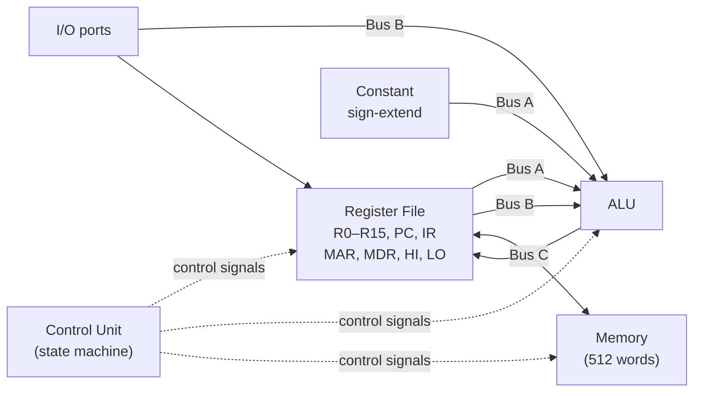

# Mini-SRC — 32-Bit RISC CPU (Verilog)

A 32-bit RISC-style processor designed in Verilog, targeting an Intel Cyclone V FPGA and verified through instruction-level simulation in ModelSim. Built for ELEC 374 (Digital Systems Engineering) at Queen's University.

The core design decision — a **three-bus datapath** — removes the intermediate `Y`/`Z` registers found in the standard single-bus reference design, cutting **two clock cycles off every instruction**.

---

## Overview

Mini-SRC is a full processor implementation: a 32-bit datapath, a sixteen-register file, an ALU with Booth-encoded multiplication and restoring division, a state-machine control unit, a memory subsystem, and branch/jump support. Each instruction was validated individually by inspecting ModelSim timing diagrams against expected register and memory state.

- **32-bit** architecture and datapath
- **16 × 32-bit** register file (general-purpose, argument, return-value, stack-pointer, and return-address registers) plus `PC`, `IR`, `MAR`, `MDR`, `HI`, `LO`
- **512-word** memory
- **Constant** 6-cycle instruction execution (fetch + decode/execute)
- Target: **Cyclone V (5CEBA4F23C7)** on the DE0-CV development board

---

## Why three buses

The reference Mini-SRC uses a single bus and stages ALU operands through two temporary registers (`Y` and `Z`), which costs extra cycles per instruction to load and read them.

This implementation uses three buses instead:

- **Bus A** — feeds the 16 general-purpose registers and the sign-extended constant into ALU input 1
- **Bus B** — feeds the general-purpose registers plus `PC`, `MDR`, `HI`, `LO`, and the input port into ALU input 2
- **Bus C** — routes the ALU output back to any destination register

Because both ALU operands are driven directly onto Bus A and Bus B in the same cycle, the `Y` and `Z` registers are eliminated entirely — **saving two clock cycles on every instruction** and simplifying the datapath.

---

## Architecture



Key modules:

- **ALU** — takes operands from Bus A and Bus B plus an opcode, outputs to Bus C
- **Control Unit** — a state machine that drives every control signal per clock cycle based on the current instruction and state
- **Memory subsystem** — memory plus the `MAR` (address) and `MDR` (data) registers
- **CONFF** — evaluates branch conditions (zero, non-zero, positive, negative) and enables the program counter
- **Select/Encode** — decodes register indices from the instruction register and asserts the correct register enables

---

## Instruction set

| Category | Instructions |
|---|---|
| Load / store | `ld`, `ldi`, `st` |
| Arithmetic | `add`, `addi`, `sub`, `neg`, `mul`, `div` |
| Logic | `and`, `andi`, `or`, `ori`, `not` |
| Shift / rotate | `shr`, `shra`, `shl`, `ror`, `rol` |
| Move (HI/LO) | `mfhi`, `mflo` |
| Branch | `brzr`, `brnz`, `brpl`, `brmi` |
| Jump | `jr`, `jal` |
| I/O | `in`, `out` |
| Control | `nop`, `halt` |

### ALU implementation notes

- **Addition/subtraction** use a hierarchical **carry-lookahead adder** (4-bit CLA blocks composed into a 32-bit adder) rather than a ripple-carry chain
- **Multiplication** uses the **Booth pairs (radix-4)** algorithm, producing a 64-bit result across `HI`/`LO`
- **Division** uses a **restoring division** algorithm

---

## Build phases

1. **Datapath foundation** — registers, buses, ALU, and per-operation ALU test benches
2. **Instruction execution** — Select/Encode logic, CONFF branching, memory subsystem, I/O ports; switched to the three-bus architecture here
3. **Control unit** — state machine decoding opcodes and asserting control signals per cycle, verified in ModelSim
4. **FPGA target** — synthesis/place-and-route for the Cyclone V and a seven-segment hex-display output interface

---

## Results

- Targets the DE0-CV's **50 MHz** clock (higher frequencies possible depending on synthesized logic delay)
- **Constant 6 cycles per instruction** in the current design
- Uses **~32% of available ALMs** (place-and-route, excluding the full RAM footprint)
- Every instruction in the set was verified against expected register/memory results via timing-diagram analysis

---

## Status & limitations

- **Verified in simulation (ModelSim), not on physical hardware.** Phase 4 was synthesized and taken through place-and-route for the Cyclone V, but the design was not deployed and run on the DE0-CV board due to time constraints. The simulation behaved correctly apart from the seven-segment display output.
- The full design (including the complete RAM) exceeds the DE0-CV's available logic blocks, so on-board bring-up would require trimming memory or optimizing resource usage first.

---

## Tools

- **Verilog** (RTL)
- **Intel Quartus Prime** — design, synthesis, place-and-route
- **Intel ModelSim** — functional simulation and timing verification
- Target device: **Cyclone V 5CEBA4F23C7** (DE0-CV board)

---

## Repository structure

> Adjust this to match your actual files.

```
.
├── src/            # Verilog modules (datapath, ALU, control unit, memory, CONFF, select-encode)
├── sim/            # test benches and mem_init.hex program files
├── docs/           # final report and timing-diagram figures
└── README.md
```

---

## Acknowledgements

Developed as a group project for ELEC 374 (Digital Systems Engineering), Queen's University, Winter 2024.

---

## Future work

- Reduce the instruction fetch from 3 cycles to 2 by combining the `PCout`, `PCen`, and increment operations into a single cycle
- Skip unused cycles for shorter instructions instead of always running the full 6-cycle sequence
- Move the control unit from combinational per-signal logic to a lookup-based approach for easier extension with new instructions
- Complete on-board deployment and testing on the DE0-CV
